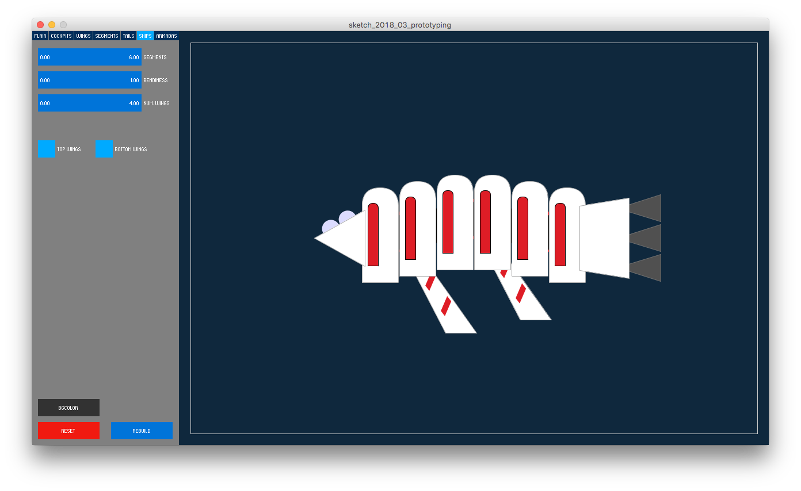

### Procedurally Generated Ships

This is a [Processing](http://www.processing.org) sketch that allows users to play with parameters and constraints on a simple prototype of a spaceship generator. Processing is free to download [here](https://processing.org/download/).

Download this repository either to run the code in Processing or for a pre-built executable of the code. 

Windows Users: unzip `generative_ships_windows.zip` for the executable.

MacOS Users: unzip `generative_ships_macos.zip` for the Mac app.

This code is public domain, so take it and do with it what you will.

```
Generative Ships, by Clay Heaton, March 2018

This Processing sketch is a simple prototype of composition-based
procedural content generation. If the code base looks complicated,
note that over 80% of it is related to showing the UI widgets that
expose the various parameters to make it interactive. 

The parameters that users can tweak are listed just below this comment,
above the setup() function. Most of the drawing code is in the files for
the individual components: Flair, Segment, Wing, Tail, Cockpit, Ship, Armada,
near the top of those files. Most of the code below the classes at the top is
related to drawing the UI and reading values from it. Normally, you probably
wouldn't put this much effort into UI code; I simply did it for this example.

Flair is an example of a sub-component. It is drawn on the Wing objects. The
other components should be relatively straight forward. 

While this bears little resemblance to his work, it was inspired in part
by the lovely spaceship drawings of Rob Turpin, @thisnorthernboy on Twitter.
```

Example ships:




----

Here's an example of Rob Turpin's work, which was light-inspiration for this idea.

